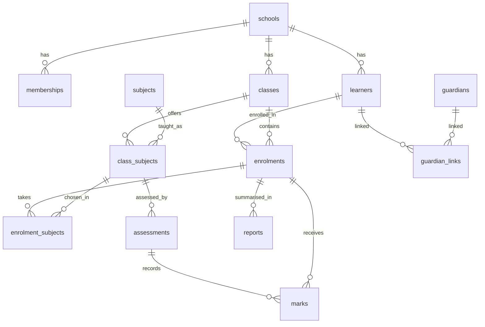
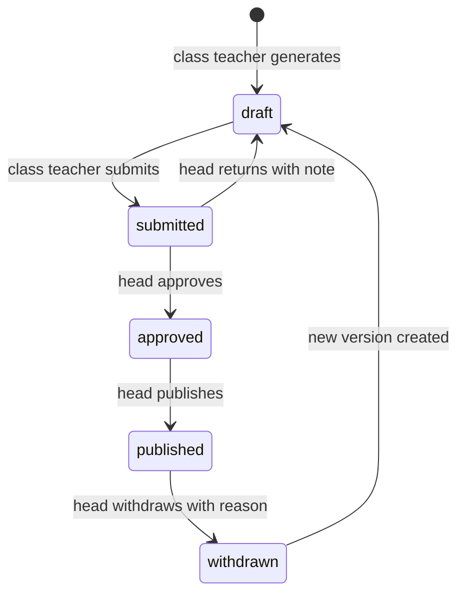

# SP Portal: Data Model

Status: DRAFT v0.1. Postgres on Supabase. Companion to `SPEC.md`. Column names match the CSV files in `seed/`.

## 1. Conventions

- Primary keys are `uuid` (`gen_random_uuid()`). Timestamps are `timestamptz` in UTC; display in `Africa/Harare`.
- **Every tenant table has `school_id uuid not null references schools(id)`**, indexed, and row-level security enabled. Exceptions: `schools` (its own `id` is the tenant), `profiles` and `platform_admins` (global, described below), and `sign_in_attempts` (global, service role only; see below).
- Child tables repeat `school_id` (even when it could be derived) so policies never need joins. A trigger or composite check ensures a child's `school_id` equals its parent's.
- Nothing personal is hard-deleted: learners, marks and reports use `status` fields. Deletion of a school is a super-admin operation done offline.
- `created_at` and `updated_at` on every table (`updated_at` set by trigger). Omitted below for brevity.
- Names are `snake_case`, plural tables, enums as Postgres enum types.

## 2. Overview



Reading it: a learner is enrolled in one class per year; each learner takes some of the class's subjects (`enrolment_subjects`); teachers set assessments per class subject; marks belong to an assessment and an enrolment; reports summarise an enrolment for a term.

## 3. Enums

| Enum                | Values                                                                                     |
| ------------------- | ------------------------------------------------------------------------------------------ |
| `school_stage`      | primary, secondary, combined                                                               |
| `app_role`          | school_admin, head, hod, teacher, parent, learner (super admin lives in `platform_admins`) |
| `membership_status` | invited, active, disabled                                                                  |
| `level_stage`       | ecd, primary, o_level, a_level                                                             |
| `term_kind`         | term, vacation, mock                                                                       |
| `term_status`       | planned, open, locked, closed                                                              |
| `assessment_type`   | test, assignment, exam, practical, vacation                                                |
| `mark_status`       | present, absent, excused                                                                   |
| `comment_status`    | draft, submitted                                                                           |
| `report_status`     | draft, submitted, approved, published, withdrawn                                           |
| `enrolment_status`  | enrolled, promoted, repeating, transferred, left, graduated                                |
| `audience_type`     | all, staff, learners, parents, class                                                       |
| `sex`               | F, M (Q27)                                                                                 |

## 4. Tables

### 4.1 Platform and tenancy

**schools**: the tenant.

```
id, slug unique, name, motto, stage school_stage, address, phone, email,
logo_path, stamp_path, head_signature_path,           -- Supabase Storage paths
primary_color, accent_color,                           -- hex, contrast-checked
report_footer_text, timezone default 'Africa/Harare',
feature_flags jsonb default '{}', status ('active'|'suspended')
```

**profiles**: one row per person, global (`id` = `auth.users.id`).

```
id pk fk auth.users, full_name, email, phone
```

Readable only by the person themselves and by users who share a school with them through `memberships`.

**platform_admins**: `user_id pk fk auth.users`. Super admins. No policy grants them tenant data by default (support access is a deliberate later feature).

**sign_in_attempts**: `id bigint identity pk`, `email_hash` (SHA-256 hex of the trimmed, lower-cased email), `succeeded bool`, `created_at`. Per-account sign-in lockout (US-1.1); wrong password-reset codes count too (US-1.7, D19). No `school_id`, because the school is unknown before sign in. RLS on with no policies and privileges revoked from `anon` and `authenticated`: only the service role reads or writes it.

**memberships**: a person's role in a school.

```
id, school_id, user_id fk profiles, role app_role, status membership_status
unique (school_id, user_id, role)
```

A person can have several rows (a teacher who is also a parent; a teacher in two schools).

**invites**

```
id, school_id, role app_role, email, phone, guardian_id null, learner_id null,
code_hash, expires_at, accepted_at null, created_by
```

**import_jobs**

```
id, school_id, kind ('staff'|'learners'|'marks'), status ('validated'|'committed'|'failed'),
file_path, error_report jsonb, created_by
```

### 4.2 Academic structure

**grade_levels**

```
id, school_id, name ('Form 4'), stage level_stage, sort_order, grading_scale_id fk
```

**academic_years**

```
id, school_id, label ('2026'), starts_on, ends_on, is_current
unique (school_id, label); at most one is_current per school
```

**terms**: reporting periods.

```
id, school_id, academic_year_id, name, kind term_kind, starts_on, ends_on,
marks_deadline date, status term_status
```

**classes**

```
id, school_id, academic_year_id, grade_level_id, name ('4 Blue'),
class_teacher_id fk profiles
unique (academic_year_id, name)
```

**subjects**

```
id, school_id, code, name, stage_scope, is_core boolean, sort_order
unique (school_id, code)
```

**class_subjects**: a subject taught to a class, with its teacher.

```
id, school_id, class_id, subject_id, teacher_id fk profiles not null
unique (class_id, subject_id); teacher and class teacher must be active teacher or hod (D20)
```

### 4.3 People in the school

**learners**

```
id, school_id, learner_number, first_name, last_name, date_of_birth, sex,
status ('active'|'left'|'graduated'), user_id null fk profiles, admission_date
unique (school_id, learner_number)
```

**enrolments**: a learner in a class for a year.

```
id, school_id, learner_id, class_id, academic_year_id, status enrolment_status
unique (learner_id, academic_year_id)
```

**enrolment_subjects**: the subjects an enrolled learner takes.

```
id, school_id, enrolment_id, class_subject_id
unique (enrolment_id, class_subject_id)
check: class_subject.class_id = enrolment.class_id (trigger)
```

**guardians**

```
id, school_id, full_name, phone, email, user_id null fk profiles
```

**guardian_links**

```
id, school_id, guardian_id, learner_id, relationship, is_primary
unique (guardian_id, learner_id)
```

One guardian linked to two learners is how siblings appear under one parent login.

### 4.4 Assessment

**grading_scales**: `id, school_id, name, stage level_stage, is_default`

**grading_bands**

```
id, school_id, scale_id, grade, min_mark int, max_mark int, remark, sort_order
check min_mark <= max_mark; a validation function proves a scale covers 0 to 100
with no gaps or overlaps before it can be set default
(grading_scale_problems, grading_scale_is_complete; D21).
```

**assessments**

```
id, school_id, term_id, class_subject_id, name, type assessment_type,
max_mark numeric, weight_percent numeric, sort_order, assessed_on, is_locked boolean
```

A validation function checks `sum(weight_percent) = 100` per (term, class_subject); report generation refuses otherwise.

**marks**

```
id, school_id, assessment_id, enrolment_id, score numeric null,
status mark_status, entered_by fk profiles
unique (assessment_id, enrolment_id)
check: (status = 'present' and score between 0 and max_mark) or (status <> 'present' and score is null)
```

**subject_comments**

```
id, school_id, term_id, enrolment_id, class_subject_id, teacher_id,
comment text, status comment_status, signed_at
unique (term_id, enrolment_id, class_subject_id)
```

**class_comments**

```
id, school_id, term_id, enrolment_id, author_id, comment, status comment_status
unique (term_id, enrolment_id)
```

**comment_bank**

```
id, school_id, owner_id, subject_id null, grade null, text, is_shared boolean
```

**attendance_summaries** (feature-flagged, Q25)

```
id, school_id, term_id, enrolment_id, days_open int, days_present int
unique (term_id, enrolment_id)
```

### 4.5 Reports

**report_templates**

```
id, school_id, name, term_kind, stage_scope, sections jsonb, footer_text
```

`sections` toggles what a report shows (position, average, attendance, class comment, head's comment, signature column, stamp). See `REPORT_LAYOUT.md`.

**reports**

```
id, school_id, term_id, enrolment_id, template_id, version int default 1,
status report_status, reference_code unique, verification_code unique,
average_percent, class_position, class_size,
head_comment, approved_by, approved_at, published_by, published_at,
snapshot jsonb,          -- frozen subject lines, comments, grading key, branding, names
pdf_path
unique (term_id, enrolment_id, version)
```

Once `published`, `snapshot` and `pdf_path` are immutable (trigger). Corrections create version + 1 and set the old row to `withdrawn`.

**report_shares**: `id, school_id, report_id, token_hash, expires_at, revoked_at, created_by`.

### 4.6 Communication and audit

**announcements**

```
id, school_id, title, body, audience audience_type, class_id null, pinned,
status ('draft'|'published'|'archived'), published_at, expires_at, author_id
```

**announcement_attachments**: `id, school_id, announcement_id, path, filename, size_bytes`
**announcement_reads**: `school_id, announcement_id, user_id, read_at` (pk on the three ids)

**audit_log**

```
id bigint identity, school_id, actor_id, table_name, row_id, action ('insert'|'update'|'delete'|'event'),
event text null, old_data jsonb, new_data jsonb, reason text null, created_at
```

Written by triggers on `marks`, `subject_comments`, `class_comments`, `reports`, `assessments`, `memberships`, `learners` (one generic function, `private.audit_row_change()`). Console events (`school_created`, `branding_changed`, `admin_invited`, `invite_resent`) use action `event` with the event name, recorded against the school they changed (D18). Append-only: no update or delete policy for anyone, and a trigger rejects update, delete and truncate even for the table owner.

## 5. Report state machine



## 6. Calculations

Implemented as SQL functions and views (and mirrored by pure TypeScript functions used in tests):

1. `subject_result(enrolment, class_subject, term)` = sum over assessments of `score / max_mark * weight_percent`. Returns `incomplete` if any assessment is `absent`, `excused` or has no mark (Q6).
2. `subject_grade` = band lookup on `round_half_up(result)` (Q1, Q4).
3. `class_average(enrolment, term)` = mean of the rounded results of completed subjects, one decimal.
4. `class_position(enrolment, term)` = competition rank of `class_average` within the class (ties share a position, next rank skipped).

Fixtures: `seed/expected_subject_results.csv` and `seed/expected_class_positions.csv` were computed independently in Python from the seed marks; tests must reproduce them exactly.

## 7. Row-level security approach

Helper functions (security definer, stable): `current_school_ids()`, `has_role(school_id, role)`, `teaches(class_subject_id)`, `is_class_teacher(class_id)`, `is_guardian_of(learner_id)`, `is_own_learner(learner_id)`, `is_platform_admin()`.

| Tables                                                                             | Read                                                                                         | Write                                                                             |
| ---------------------------------------------------------------------------------- | -------------------------------------------------------------------------------------------- | --------------------------------------------------------------------------------- |
| schools                                                                            | members of that school                                                                       | super admin (branding), school admin (limited fields)                             |
| memberships, invites, import_jobs                                                  | school admin, head                                                                           | school admin                                                                      |
| structure (levels, years, terms, classes, subjects, class_subjects, scales, bands) | staff of the school (D20)                                                                    | school admin                                                                      |
| learners, enrolments, enrolment_subjects, guardians, guardian_links                | admin, head, hod; teachers for their classes; parents and learners for themselves            | school admin                                                                      |
| assessments, marks                                                                 | admin, head; hod for department; teacher for own class subjects                              | teacher for own class subjects while term is open and not locked; admin (audited) |
| subject_comments                                                                   | as marks; parents and learners only when the report is published                             | assigned teacher; admin                                                           |
| class_comments                                                                     | as above                                                                                     | class teacher                                                                     |
| reports                                                                            | admin, head, class teacher for draft to approved; parents and learners only when `published` | class teacher (draft, submit); head (approve, publish, withdraw)                  |
| announcements                                                                      | members in the audience while published                                                      | school admin, head                                                                |
| audit_log                                                                          | admin, head                                                                                  | triggers only                                                                     |

Default is deny. Each policy has a test in each direction (allowed and blocked) and a cross-school test.

## 8. Storage buckets (Supabase Storage)

| Bucket        | Contents                  | Access                                                  |
| ------------- | ------------------------- | ------------------------------------------------------- |
| `branding`    | logos, stamps, signatures | public read (logos only), write by school admin         |
| `reports`     | published PDFs            | private; signed URLs for owners, share tokens for links |
| `attachments` | newsletter files          | private; signed URLs for audience                       |
| `imports`     | uploaded CSV/Excel        | private; school admin only; deleted after 30 days       |

Object paths start with the school id (`{school_id}/...`) so storage policies can check it.

## 9. Indexes (add in the same migration as the table)

- Every table: `(school_id)`.
- `marks (assessment_id, enrolment_id)` unique, `marks (enrolment_id)`.
- `enrolments (class_id)`, `enrolments (learner_id, academic_year_id)` unique.
- `class_subjects (teacher_id)`, `assessments (term_id, class_subject_id)`.
- `subject_comments (term_id, enrolment_id)`.
- `reports (term_id, status)`, `reports (reference_code)`, `reports (verification_code)`.
- `audit_log (school_id, created_at desc)`, `audit_log (table_name, row_id)`.
- `guardian_links (learner_id)`, `announcements (school_id, status, published_at desc)`.

## 10. Migration order

1. Extensions, enums, helper functions.
2. `schools`, `profiles`, `platform_admins`, `memberships`, `invites` + RLS + tests.
3. Structure tables (`grade_levels` ... `class_subjects`) + RLS + tests.
4. People tables (`learners` ... `guardian_links`) + RLS + tests + import functions.
5. Assessment tables + calculation functions + audit triggers + tests against the fixtures.
6. Reports tables + immutability triggers + storage policies.
7. Announcements.
8. Seed script that creates auth users for the seed profiles and loads `seed/*.csv` in this order: schools, profiles (via Auth), platform_admins, memberships, grading_scales, grade_levels, grading_bands, academic_years, terms, classes, subjects, class_subjects, learners, enrolments, enrolment_subjects, guardians, guardian_links, assessments, marks, subject_comments, class_comments, announcements.

## 11. Decisions made here that you should confirm

- One `terms` table with a `kind` instead of a separate vacation table (Q9).
- Marks keyed to `enrolment_id`, not `learner_id`, so history stays correct when a learner changes class or year.
- Weights live on each assessment (per class subject and term) instead of a global rule, so different subjects can weigh differently (Q5).
- Reports are snapshots stored as JSON plus a PDF, so later changes to marks or grade bands never change a published report.
- Class teacher is an assignment on `classes`, not a role (Q16).
